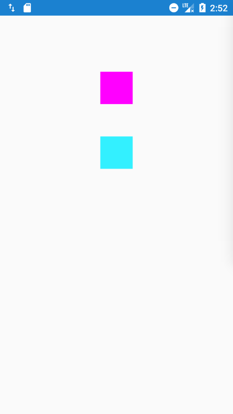

## Behavior之完全解析

### 第一个简单的自定义`Behavior`

在Android 5.0 的时候推出了`CoordinatorLayout`控件，该控件从翻译上来说称之为 协调性布局，我的理解是，对于他下面的子控件的布局，大小，滚动等等一系列的东西，由每一个子控件商量沟通着来，及每一个控件对于测量，布局等都有发言权，不在是由类似与线性布局一样，你必须垂直着排放，某某必须在下面。那么如何实现每个子控件都有发言权呢，便是通过一个叫`behavior`的来进行操作。每一个子控件都可以指定一个`behavior`,该`behavior`中会包含一些`CoordinatorLayout`在`measeure` `layout`时的回调方法，这样我们可以根据每个控件的不同来进行实现，这样就达到了布局和测量交个子控件自己来做。


首先看一下我们利用`behavior`所实现的一个简单效果。



有两个小方块，垂直居中排列，下面的小方块会跟随上面的小方块一起滑动。

该效果可以有多种方式的实现，但为了表述`behavior`的原理，实现方式可能会稍显复杂。但目的是为了更好的学习`behavior`。

**实现分析**

因为我们要学习使用`behavior`，那么肯定跟布局要使用`CoordinatorLayout`，他仅支持`layout_gravity`而不支持线性布局的垂直等排列，所以第一个问题便是怎么让下面的小方块放到合适的位置。

其次，上面方块需要能够消耗手指触摸以让自身根据手指的滑动而移动。

最后，便是使下面的方块监听上面方块的移动，以达到跟随上面方块的移动。

根据实现分析，我们来实现代码。

**代码实现**

首先布局文件`activity_behavior.xml`

```xml
<?xml version="1.0" encoding="utf-8"?>
<android.support.design.widget.CoordinatorLayout xmlns:android="http://schemas.android.com/apk/res/android"
    xmlns:app="http://schemas.android.com/apk/res-auto"
    android:layout_width="match_parent"
    android:layout_height="match_parent">
    <View
        android:id="@+id/header"
        android:layout_width="50dp"
        android:layout_height="50dp"
        android:layout_gravity="center_horizontal"
        android:layout_marginTop="50dp"
        android:background="#ff00ff"
        app:layout_behavior=".behavior.HeaderBehavior" />
    <View
        android:id="@+id/bottom"
        android:layout_width="50dp"
        android:layout_height="50dp"
        android:layout_gravity="center_horizontal"
        android:layout_marginTop="50dp"
        android:background="#33f0ff"
        app:layout_behavior=".behavior.BottomBehavior" />
</android.support.design.widget.CoordinatorLayout>
```
该布局文件中主要定义了两个带有颜色的小方块，其中需要关注三个点：

- 上面小方块定义了id为`header`，注意此id在后面会用到，因为我们下面的小方块是通过第一个方块来定位的。
- 下面小方块中有一个`layout_marginTop`属性，如果我们不做任何操作，那么该小方块会和第一个小方块重合，我们需要的是该margin 是基于第一个小方块的，类似于垂直线性布局的margin。
- 这两个子控件都分别添加了`layout_behavior`属性，该属性的值便是我们自定义的`Behvior`,注意代码中省略了包名（类似于activity的注册时可以省略包名一样）。

因为我们所有的操作都是在`behavor`中完成的，所以不在叙述`Activity`的代码。

从布局中我们可以看到定义了两个`behavior`，分别是`HeaderBehavior`和`BottomBehavior`方法，根据之前的实现分析，他们的分工如下：

- `HeaderBehavior`：实现第一个小方块消耗手指触摸事件，让自己跟随手指移动。
- `BottomBehavior`：根据第一个小方块的位置，定位自己的位置，在第一个小方块之下；监听第一个小方块，跟随第一个小方块移动。

基于此，我们看一下`HeaderBehavior`:

```java 

public class HeaderBehavior extends CoordinatorLayout.Behavior<View> {
    // 记录手指触摸的位置
    private int mLastY = 0;

    public HeaderBehavior(Context context, AttributeSet attrs) {
        super(context, attrs);
    }
    
    @Override
    public boolean onTouchEvent(CoordinatorLayout parent, View child, MotionEvent ev) {
        // 手指触摸的回调
        switch (ev.getAction()) {
            case MotionEvent.ACTION_DOWN:
                mLastY = (int) ev.getRawY();
                break;
            case MotionEvent.ACTION_MOVE:
                int y = (int) ev.getRawY();
                child.setTranslationY(child.getTranslationY() + y - mLastY);
                mLastY = y;
                break;
        }
        return true;
    }
}
```
首先，该类继承`CoordinatorLayout.Behavior`并且声明了一个泛型，该泛型主要约束当前`behavior`可以声明到哪些控件上。如果定义的是`RelativeLayout`，则只能声明到`RelativeLayout`上。

在之前说过，`Behavior`中会包含一些测量，事件触摸的回调，而`onTouchEvent`便是其中的一个回调。他会将`CoordinatorLayout`的`onTouchEvent()`回调到该方法。当前方法返回`true`，那么`CoordinatorLayout`的`onTouchEvent()`也会返回`true`。

具体的代码不在分析，就是根据手指移动，对当前控件进行偏移。

在这里如果对事件分发不是太熟悉的可能会有一个混淆，认为该`onTouchEvent()`是子控件的`onTouchEvent()`的回调。这是错误的。

**因为`behavior`中的所有回调是来自与`CoordinatorLayout.Behavior`中的相关方法的回调，与子控件无关**。

对于`BottomBehavior`，需要完成两件事情，但这两件事情都需要依赖第一个小方块，那么怎么定义依赖呢？

`Behavior`中有一个重载方法`layoutDependsOn()`,该方法能够实现我们对第一个小方块的依赖。

看一下`BottomBehavior`的代码

```java 
public class BottomBehavior extends CoordinatorLayout.Behavior<View> {
    public BottomBehavior(Context context, AttributeSet attrs) {
        super(context, attrs);
    }
    // =============== 根本：添加依赖 =============================
    @Override
    public boolean layoutDependsOn(CoordinatorLayout parent, View child, View dependency) {
        return dependency.getId() == R.id.header;
    }

    // ================ 第一部分：定位 ========================
    @Override
    public boolean onLayoutChild(CoordinatorLayout parent, View child, int layoutDirection) {
        // getDependencies  获取child 依赖的view
        List<View> dependencies = parent.getDependencies(child);
//        parent.getDependents(child)  // 获取依赖child 的控件
        View header = findFirstDependency(dependencies);
        if (header != null) {
            CoordinatorLayout.LayoutParams lp = (CoordinatorLayout.LayoutParams) child.getLayoutParams();
            Rect available = new Rect();
            available.set(parent.getPaddingLeft() + lp.leftMargin,
                    header.getBottom() + lp.topMargin,
                    parent.getWidth() - parent.getPaddingRight() - lp.rightMargin,
                    parent.getHeight() - parent.getPaddingBottom() - lp.bottomMargin);
            final Rect out = new Rect();
            GravityCompat.apply(resolveGravity(getFinalGravity(lp.gravity)), child.getMeasuredWidth(),
                    child.getMeasuredHeight(), available, out, layoutDirection);
            child.layout(out.left, out.top, out.right, out.bottom);
        } else {
            super.onLayoutChild(parent, child, layoutDirection);
        }
        return true;
    }

    public int getFinalGravity(int gravity) {
        // 获取当前控件的`layout_gravity`属性
        if ((gravity & Gravity.VERTICAL_GRAVITY_MASK) == 0) {
            gravity = gravity | Gravity.TOP;
        }
        if ((gravity & Gravity.HORIZONTAL_GRAVITY_MASK) == 0) {
            gravity = gravity | Gravity.LEFT;
        }
        return gravity;
    }

    private static int resolveGravity(int gravity) {
        return gravity == Gravity.NO_GRAVITY ? GravityCompat.START | Gravity.TOP : gravity;
    }

    private View findFirstDependency(List<View> views) {
        // 查找最根本的依赖
        for (View view : views) {
            if (view.getId() == R.id.header) {
                return view;
            }
        }
        return null;
    }
    // ================ 第二部分：监听移动 ========================
    @Override
    public boolean onDependentViewChanged(CoordinatorLayout parent, View child, View dependency) {
        child.setTranslationY(dependency.getTranslationY());
        return true;
    }
}

```

根据功能，分为了三个部分，首先通过`layoutDependsOn`方法定义依赖，返回`true`表示需要依赖，从该方法可以看出对于一个控件可以添加对个依赖。

其次，对子控件进行定位，重写`onLayoutChild()`方法，该方法回调`CoordinatorLayout`的`onLayout`，在这里我们可以对子控进行定位。

通过`parent.getDependencies(child)`获取到当前子控件所依赖的所有控件，然后通过`findFirstDependency()`找到我们定位所用到的`headerView`，最后根据`headerView`的位置计算剩余可用的空间进行定位，调用立刻`child.layout()`确定最终的位置。

最后便是监听第一个小方块的移动，因为我们通过`layoutDependsOn`添加了依赖，那么我们可以重载`onDependentViewChanged()`方法，该方法在关心的控件位置和大小发生变化时会回调。


**总结**

整个流程下来，总的来说就是定义`Behavior`，在`Behavior`的重载方法中完成对子控件的`measure` `layout` 事件处理等等。

最后强调一下 **`behavior`中的所有回调是来自与`CoordinatorLayout.Behavior`中的相关方法的回调，与子控件无关**。

### Behavior中相关重载方法分析

在上一个例子中，我们了解到`behavior`的关键便是重载一些方法，那么都是有那些方法可以重载呢，我们往下看：

> 下面的方法都是我们自定义`behavior`中的方法，注意的是该方法是由`CoordinatorLayout`的相关方法中调用得以接到回调。

**public void onAttachedToLayoutParams(@NonNull CoordinatorLayout.LayoutParams params)**

调用时机： 当这个`behavior`被加入到`LayoutParams`中时，实际是指`LayoutParams`被创建时回调。

**public void onDetachedFromLayoutParams()**

当`behavior`从`LayoutParams`中移除时回调，当`View`从`CoordinatorLayout`中移除时不会被回调。


**public boolean onInterceptTouchEvent(CoordinatorLayout parent, V child, MotionEvent ev)**

其回调时机比较复杂，具体逻辑如下：

- 遍历所有的`behavior`, 按照顺序执行`onInterceptTouchEvent()`
- 如果其中一个`behhavior`的`onInterceptTouche`返回true
	- 如果当前事件是`ACTION_DOWN`:则后面的`behavior`的`onIntercepTouchEvent()`就不会被回调
	- 如果当前事件是其他事件，则后面会被收到一个`ACTION_CANCEL` 事件

在`CoordinatiorLayout`的`onInterceptTouchEvent()`中，如果有某一个`Behavior`返回`true`，则会保存该对象，以便`onTouchEvent()`时使用。

> 如果该方法返回true，则`CoordinatiorLayout`的`onInterceptTouchEvent()`方法也会返回true;

**public boolean onTouchEvent(CoordinatorLayout parent, V child, MotionEvent ev)**

- 如果在`onInterceptTouchEvent()`时，某一个`behavior`返回了true,则会直接调用它的`onTouchEvent()`方法。
- 如果不符合上面的条件，他会走和`onInterceptTouchEvent()`时的类似逻辑
  - `Down`事件时，在某一个`behavior`的`onTouchEvent()`返回`true`之前的`behavior`都会被调用，之后的不会调用。
  - 其他事件，在某一个`behavior`的`onTouchEvent()`返回`true`之前的`behavior`都会被调用，之后的会受到一个`CANCEL`事件。

> 注意，如果再`onInterceptTouchEvent()`时没有找到一个处理的`Behavior`对象，会在`onTouchEvent`时遍历所有`behavior`，一旦找到一个`behavior`处理，则不会再一次遍历所有，而是使用保存的`behavior`对象。

**public boolean blocksInteractionBelow(CoordinatorLayout parent, V child)**

返回当前控件是否拦截触摸事件，因为触摸事件一般是按照子view自向往上进行便利，如果该方法返回了true，则会拦截触摸事件往下的传递，默认返回为false。其内部默认的实现如下：

```java
 public boolean blocksInteractionBelow(CoordinatorLayout parent, V child) {
            return getScrimOpacity(parent, child) > 0.f;
        }
```

可见其一般是通过`getScrimOpacity()`来判断的

**public float getScrimOpacity(CoordinatorLayout parent, V child)**

该方法限定返回值[0.0 ,1.0]，如果大于0，则上面那个方法返回true ,则会拦截事件。同时该方法的返回会决定一个透明度。因为如果事件无法向下传递，会在`CoordinatorLayout`中画一个蒙层，优先于该`View`的在蒙层的上方，无法处理触摸的在蒙层的下方

**public int getScrimColor(CoordinatorLayout parent, V child)**

拦截事件后蒙层的颜色，默认是黑色。

**public boolean layoutDependsOn(CoordinatorLayout parent, V child, View dependency)**

决定该`View`依赖的其他`View`，如果返回`true`，表示`child`关心`dependency`的变化，具体那些变化，会在下面的一些回调方法中展示

**public boolean onDependentViewChanged(CoordinatorLayout parent, V child, View dependency)**

当`View`关心的`dependency`发生`size`或者`position`的变化时，会回调该方法，如果该方法内也修改了`view`的`position`或者`size`,则该方法应该返回`true`

**public void onDependentViewRemoved(CoordinatorLayout parent, V child, View dependency)**

关心的`View`从`CoordinatorLayout`中移除时的回调通知

**public boolean onMeasureChild(CoordinatorLayout parent, V child,int parentWidthMeasureSpec, int widthUsed,  int parentHeightMeasureSpec, int heightUsed)**

`measure`时的回调，该方法如果返回`true`,则不会在走默认的子类测量流程。

**public boolean onLayoutChild(CoordinatorLayout parent, V child, int layoutDirection)**

`onLayout()`时的回调，如果返回`true`，则`view`的具体位置由该方法来定位。

**public static void setTag(View child, Object tag)**
**public static Object getTag(View child)**

对指定的`child`设置和获取标签。

**public boolean onStartNestedScroll(CoordinatorLayout coordinatorLayout, V child, View directTargetChild, View target, int nestedScrollAxes)**

该嵌套滚动和事件分发不同，每一个`behavior`的该方法都会被回调。只要有一个返回`true`,则`CoordinatorLayout`也会返回true。

**public void onNestedScrollAccepted(CoordinatorLayout coordinatorLayout, V child, View directTargetChild, View target, int nestedScrollAxes)**
上一个方法返回true ,则该方法就会被调用

**public void onStopNestedScroll(CoordinatorLayout coordinatorLayout, V child, View target)**

停止嵌套滚动时的回调，每一个`behavior`都会被调用

**public void onNestedScroll(CoordinatorLayout coordinatorLayout, V child, View target,int dxConsumed, int dyConsumed, int dxUnconsumed, int dyUnconsumed)**

嵌套滚动相关，每一个`behavior`都会被调用

**public void onNestedPreScroll(CoordinatorLayout coordinatorLayout, V child, View target, int dx, int dy, int[] consumed)**

嵌套滚动相关，每一个`behavior`都会被调用，但是因为其在嵌套滚动之前调用，则会计算每一个`behavior`中的消耗，获取最大的消耗往下传。

**public boolean onNestedFling(CoordinatorLayout coordinatorLayout, V child, View target,float velocityX, float velocityY, boolean consumed)**

嵌套滚动相关，每一个`behavior`都会被调用

**public boolean onNestedPreFling(CoordinatorLayout coordinatorLayout, V child, View target,float velocityX, float velocityY)**

嵌套滚动相关，每一个`behavior`都会被调用

**public void onRestoreInstanceState(CoordinatorLayout parent, V child, Parcelable state)**
**public Parcelable onSaveInstanceState(CoordinatorLayout parent, V child)**

数据的保存和恢复相关。

**public WindowInsetsCompat onApplyWindowInsets(CoordinatorLayout coordinatorLayout, V child, WindowInsetsCompat insets)**
**public boolean onRequestChildRectangleOnScreen(CoordinatorLayout coordinatorLayout, V child, Rect rectangle, boolean immediate)**
**public boolean getInsetDodgeRect(@NonNull CoordinatorLayout parent, @NonNull V child,@NonNull Rect rect)**

暂时不知道是什么意思。。


### 关于`CoordinatorLayout`中触摸分发事件`onInterceptTouchEvent()`和`onTouchEvent（）`的相关源码分析

从之前的介绍中，了解到我们可以在`Behavior`中重载`onTouchEvent()`和`onInterceptTouchEvent()`方法用以获取`CoordinatorLayout`的事件处理，那么对于多个`behavior`的触摸事件监听，具体回调流程是怎么样呢，下面我们就开始走进科学～

首先看一下`CoordinatorLayout`的`onInterceptTouchEvent()`方法源码：

```java

   @Override
    public boolean onInterceptTouchEvent(MotionEvent ev) {
        MotionEvent cancelEvent = null;

        final int action = MotionEventCompat.getActionMasked(ev);

        // Make sure we reset in case we had missed a previous important event.
        if (action == MotionEvent.ACTION_DOWN) {
            // 重置behavior的状态,主要是将behavior拦截事件置为true
            resetTouchBehaviors();
        }

        // 遍历所有的behavior ,获取事件处理状态
        final boolean intercepted = performIntercept(ev, TYPE_ON_INTERCEPT);

        if (cancelEvent != null) {
            // 搞不懂。。。
            cancelEvent.recycle();
        }

        if (action == MotionEvent.ACTION_UP || action == MotionEvent.ACTION_CANCEL) {
            // 事件结束，重置behavior 的状态
            resetTouchBehaviors();
        }
        return intercepted;
    }
```
在开始的时候会重置一下`Behavior`的状态，这个状态主要指的是`block`,在前面`behavior`的方法列举中，可以看到`blocksInteractionBelow()`方法，该方法会返回是否拦截后面控件的事件，在这里，会先重置一下，默认为不拦截。

然后通过`performIntercept(ev, TYPE_ON_INTERCEPT)`方法来遍历所有的`behavior`获取处理状态，最后返回。

看一下`performIntercept()`的源码：

```java 
 private boolean performIntercept(MotionEvent ev, final int type) {
        boolean intercepted = false;
        boolean newBlock = false;
        MotionEvent cancelEvent = null;
        final int action = MotionEventCompat.getActionMasked(ev);
        // 获取所有的View ,该View 的顺序在不改变绘图优先级时，默认是所有子控件的倒序，及自下往上
        final List<View> topmostChildList = mTempList1;
        getTopSortedChildren(topmostChildList);
        final int childCount = topmostChildList.size();
        // 遍历所有的View ,对包含`behavior`的进行处理回调
        for (int i = 0; i < childCount; i++) {
            final View child = topmostChildList.get(i);
            final LayoutParams lp = (LayoutParams) child.getLayoutParams();
            final Behavior b = lp.getBehavior();
            // Down事件，则不会走此逻辑，对于Move事件，如果intercepted 或 newBlock为true,则会回调一个ACTION_CANCEL
            if ((intercepted || newBlock) && action != MotionEvent.ACTION_DOWN) {
                // Cancel all behaviors beneath the one that intercepted.
                // If the event is "down" then we don't have anything to cancel yet.
                if (b != null) {
                    if (cancelEvent == null) {
                        final long now = SystemClock.uptimeMillis();
                        cancelEvent = MotionEvent.obtain(now, now,
                                MotionEvent.ACTION_CANCEL, 0.0f, 0.0f, 0);
                    }
                    switch (type) {
                        case TYPE_ON_INTERCEPT:
                            b.onInterceptTouchEvent(this, child, cancelEvent);
                            break;
                        case TYPE_ON_TOUCH:
                            b.onTouchEvent(this, child, cancelEvent);
                            break;
                    }
                }
                continue;
            }
            // 关键方法，找到处理的behavior ,并处理，一旦某个behavior的方法返回true ,则后面的都不会在执行此逻辑
            if (!intercepted && b != null) {
                switch (type) {
                    case TYPE_ON_INTERCEPT:
                        intercepted = b.onInterceptTouchEvent(this, child, ev);
                        break;
                    case TYPE_ON_TOUCH:
                        intercepted = b.onTouchEvent(this, child, ev);
                        break;
                }
                // 保存处理的behavior对象
                if (intercepted) {
                    mBehaviorTouchView = child;
                }
            }

            // 在onInterceptTouchEvent 中 DOWN事件，会重置所有的behavior的状态，该返回字段为false;
            // 所以对于DOWN事件，肯定不会走下面的break;提前结束循环
            // 而对于其他事件，如果wasBlocking 返回true ,则肯定会走入下面的break逻辑，提前跳出。及后面的behavior不会在回调，类似于拦截。
            final boolean wasBlocking = lp.didBlockInteraction();
            //如果wasBlocking为false , 该方法会调用每一个的behavior的blocksInteractionBelow()判断是否拦截向后面behavior的遍历，并将值赋值给didBlockInteraction()；
            final boolean isBlocking = lp.isBlockingInteractionBelow(this, child);
            newBlock = isBlocking && !wasBlocking;
            if (isBlocking && !newBlock) {
                // isBlock == true   wasBlock = true 走入逻辑，
                break;
            }
        }
        topmostChildList.clear();
        return intercepted;
    }

```

该方法中区分`onTouchEvent()`和`onInterceptTouchEvent()`，可见他们的遍历逻辑几乎一致。

代码注释上可以仔细撸一撸，到这里我们可以总结一下`onInterceptTouchEvent()`的执行逻辑，

对于每一个`behavior`的`onInterceptTouchEvent()`方法，会先按照`CoordinatorLayout`布局中自下往上（可能有特殊情况，改变绘制优先级时）进行遍历：

如果是`DOWN`事件，会遍历到直到某一个`behavior`的`onInterceptTouchEvent()`返回true为止，后面的不会在调用。在`Down`事件时，会找出在哪一个`behavior`会强制拦截所有事件。通过`behavior`的`blocksInteractionBelow()`作为依据。

如果是除了`DOWN`事件，如果有强制拦截事件，则首先强制拦截事件的子控件之后的控件不会被回调。然后，依然从开始遍历，遍历到强制拦截事件的子控件结束为止，如果其中一个返回了`true`，则后面的会收到一个`CANCEL`事件。

在`onInterceptTouchEvent()`执行逻辑中，如果找到某个`behavior`处理事件，即返回true，则会保存该对象，以便`onTouchEvent()`中使用。


那么在看一下`CoordinatorLayout`的`onTouchEvent()`源码

```java

@Override
    public boolean onTouchEvent(MotionEvent ev) {
        boolean handled = false;
        boolean cancelSuper = false;
        MotionEvent cancelEvent = null;
        final int action = MotionEventCompat.getActionMasked(ev);
        // 如果onInterceptTouchEvent()中找到了一个behvior中处理事件，则直接使用，否则调用performIntercept()查找处理的behavior
        if (mBehaviorTouchView != null || (cancelSuper = performIntercept(ev, TYPE_ON_TOUCH))) {
            final LayoutParams lp = (LayoutParams) mBehaviorTouchView.getLayoutParams();
            final Behavior b = lp.getBehavior();
            if (b != null) {
                // 回调事件
                handled = b.onTouchEvent(this, mBehaviorTouchView, ev);
            }
        }

        // 如果没有behavior 处理，则会调用基类的onTouchEvent()
        if (mBehaviorTouchView == null) {
            handled |= super.onTouchEvent(ev);
        } else if (cancelSuper) {
            // 在Down 的时候没有处理，在Move的时候处理，则需要取消之前的调用
            if (cancelEvent == null) {
                final long now = SystemClock.uptimeMillis();
                cancelEvent = MotionEvent.obtain(now, now,
                        MotionEvent.ACTION_CANCEL, 0.0f, 0.0f, 0);
            }
            // 取消当前控件的事件处理，因为有某一个behavior处理了事件
            super.onTouchEvent(cancelEvent);
        }

        if (!handled && action == MotionEvent.ACTION_DOWN) {

        }

        if (cancelEvent != null) {
            cancelEvent.recycle();
        }

        if (action == MotionEvent.ACTION_UP || action == MotionEvent.ACTION_CANCEL) {
            resetTouchBehaviors();
        }

        return handled;
    }
```

注意：在`onTouchEvent()`中没有重置`behavior`的状态。及拦截所有事件的状态。

开始的时候，如果`onInterceptTouchEvent()`中找到了处理的`mBehaviorTouchView`,则直接调用对应`behavior`的`onTouchEvent()`方法，其他的不会调用。如果该`behavior`返回`false`，则`CoordinatorLayout`的`onTouchEvent()`也返回`false`。

如果没有找到，则会调用`performIntercept()`找到要处理的`behavior`，此时会回调`behavior`的`onTouchEvent()`方法。如果依然没有处理，则会调用基类的` super.onTouchEvent()`处理事件，如果有事件处理，则会给积累发送一个取消事件。

至于他的遍历逻辑，及`performIntercept()`中的逻辑和`onInterceptTouchEvent()`时的几乎一致。


**总结**

基本：所有的遍历都是从`CoordinatorLayout`中子控件倒序开始遍历的（改变绘制流程除外）

`onInterceptTouchEvent()`调用逻辑：

- 对于Down事件：会回调从第一个开始知道某一个的`behavior`的`onInterceptTouchEvent()`返回true。
- 对于除了Down以外的事件：如果`behavior`的`blocksInteractionBelow()`返回true ，则会拦截所有事件。即只遍历从第一个到该`behavior`，在遍历过程中的某一个`behavior`的`onInterceptTouchEvent()`返回true，则其之前的正常回调，其之后的会获得一个`CANCEL`事件。

`onTouchEvent()`调用逻辑

- 如果`onInterceptTouchEvent()`中找到了`behavior`，及某个`behavior`的`onInterceptTouchEvent()`返回了true。则逻辑如下：
	- 直接调用该`behavior`的`onTouchEvent()`方法，如果该方法返回`false`，则调用基类的`super.onTouchEvent()`。

- 如果`onInterceptTouchEvent()`没有找到，则会进行遍历，遍历范围为从第一个到某个`behavior`的`blocksInteractionBelow()`返回true为止。如果找到了，会保存，不会在遍历。
	- DOWN事件： 会回调从第一个开始知道某一个的`behavior`的`onTouchEvent()`返回true。
	- 其他事件：即只遍历从第一个到该`behavior`，在遍历过程中的某一个`behavior`的`onTouchEvent()`返回true，则其之前的正常回调，其之后的会获得一个`CANCEL`事件。
	- 注意，该遍历如果找到处理的了，无论是`Down`或者其他事件，则不会在遍历，只会使用找到的`behavior`，如果没找到，则其他事件时，会再次遍历。


